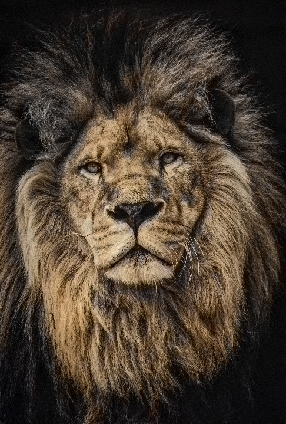

# Image-Colorization

This project uses a pretrained Neural network model to add colors to black and white images. The Neural network leverages its learned features to predict and apply colors, transforming grayscale inputs into vibrant, colored outputs automatically.

Sample inputs and their outputs:

   

   

   
